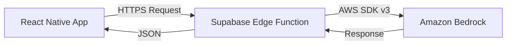

# Implementation Guide: Connecting React Native to Amazon Bedrock

Since you cannot safely store AWS credentials in a React Native app, you must proxy requests through a backend. You already have Supabase Edge Functions set up, which is a perfect place for this.

## Architecture



## Step 1: Envrionment Variables
You need to add your AWS credentials to your Supabase project (both local `.env` and remote).

**Required Secrets:**
- `AWS_ACCESS_KEY_ID`
- `AWS_SECRET_ACCESS_KEY`
- `AWS_REGION` (e.g., `us-east-1` or `us-west-2` where Bedrock is active)

## Step 2: Deno Dependencies
In your Edge Function (e.g., `supabase/functions/bedrock-agent/index.ts`), you need to import the AWS SDK. Since Deno allows direct URL imports, you can import from `esm.sh`.

```typescript
import { 
  BedrockRuntimeClient, 
  InvokeModelCommand 
} from "npm:@aws-sdk/client-bedrock-runtime";
```
*Note: Using `npm:` specifiers is supported in newer Supabase/Deno runtimes.*

## Step 3: Example Edge Function Code

Here is a complete example of a Supabase Edge Function that calls Amazon Nova Lite.

```typescript
import { serve } from "https://deno.land/std@0.168.0/http/server.ts";
import { 
  BedrockRuntimeClient, 
  InvokeModelCommand 
} from "npm:@aws-sdk/client-bedrock-runtime";

const corsHeaders = {
  'Access-Control-Allow-Origin': '*',
  'Access-Control-Allow-Headers': 'authorization, x-client-info, apikey, content-type',
};

serve(async (req) => {
  // Handle CORS
  if (req.method === 'OPTIONS') {
    return new Response('ok', { headers: corsHeaders });
  }

  try {
    const { prompt } = await req.json();

    const client = new BedrockRuntimeClient({
      region: Deno.env.get('AWS_REGION'),
      credentials: {
        accessKeyId: Deno.env.get('AWS_ACCESS_KEY_ID')!,
        secretAccessKey: Deno.env.get('AWS_SECRET_ACCESS_KEY')!,
      },
    });

    // Valid Request body for Amazon Nova models
    // Nova uses the "Converse" API format usually, or a specific payload. 
    // This is the generic invocation payload for Nova:
    const payload = {
      inferenceConfig: {
         max_new_tokens: 1000
      },
      messages: [
        {
          role: "user",
          content: [
            { text: prompt }
          ]
        }
      ]
    };

    const command = new InvokeModelCommand({
      modelId: "amazon.nova-lite-v1:0", // Check exact model ID in AWS Console
      contentType: "application/json",
      accept: "application/json",
      body: JSON.stringify(payload),
    });

    const response = await client.send(command);
    const decodedResponseBody = new TextDecoder().decode(response.body);
    const responseBody = JSON.parse(decodedResponseBody);

    // Extract the text from Nova's response structure
    const outputText = responseBody.output.message.content[0].text;

    return new Response(JSON.stringify({ result: outputText }), {
      headers: { ...corsHeaders, 'Content-Type': 'application/json' },
    });

  } catch (error) {
    return new Response(JSON.stringify({ error: error.message }), {
      status: 500,
      headers: { ...corsHeaders, 'Content-Type': 'application/json' },
    });
  }
});
```

## Step 4: Calling from React Native

```typescript
import { supabase } from '../lib/supabase'; // Your supabase client setup

const callBedrock = async (userPrompt: string) => {
  const { data, error } = await supabase.functions.invoke('bedrock-agent', {
    body: { prompt: userPrompt },
  });

  if (error) {
    console.error('Error calling Bedrock:', error);
    return;
  }

  console.log('Bedrock Response:', data.result);
};
```
